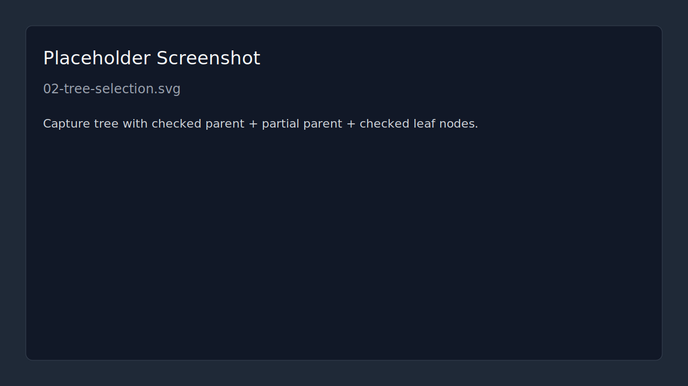
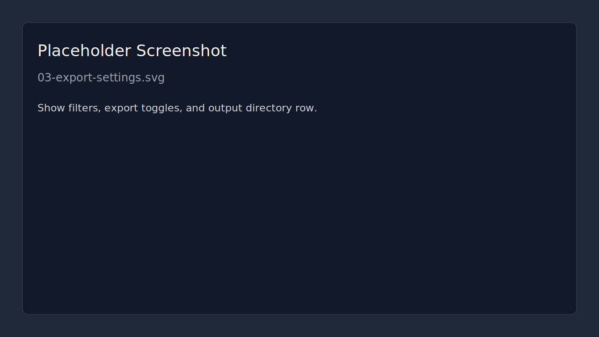
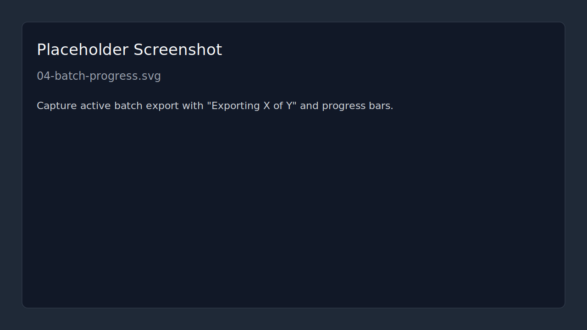

# ArchiveCord

[](https://github.com/DrMemoryFish/ArchiveCord/releases)

ArchiveCord exports Discord DMs and server channels to JSON/TXT/attachments with preview, filters, and live logs.

## Highlights
- Multi-select DMs/channels with hierarchical server/category checkboxes.
- Sequential batch export with per-item and overall progress.
- Preview updates while exporting.
- User-writable default export/log paths (cross-platform).
- Cross-platform release artifacts (Windows/macOS/Linux).

## 60-Second Quickstart
1. Download your build from [Releases](https://github.com/DrMemoryFish/ArchiveCord/releases).
2. Run the app (`win64-portable`, `win64-setup`, `macos-universal.dmg/zip`, or `linux AppImage/tar.gz`).
3. Paste your Discord token and click `Connect`.
4. Check one or more DMs/channels in the left tree.
5. Keep default export options or tweak them.
6. Click `Export & Process`.
7. Find output in your selected folder.

Default output (if you do not change it):
- Windows: `C:\Users\<User>\Documents\ArchiveCord\exports`
- macOS: `~/Documents/ArchiveCord/exports`
- Linux: `~/Documents/ArchiveCord/exports`
- Fallback if Documents is unavailable: user app-data `ArchiveCord/exports`
- Custom output path is persisted in app settings and reused on next launch.

## First Export in 2 Minutes
1. Launch ArchiveCord and paste token.
2. Click `Connect` and wait for DMs/Servers to load.
3. In the conversation tree, check a DM, a channel, or an entire server/category (propagates to descendants).
4. Optional: set `Before` / `After` date-time filters.
5. Ensure at least one output format is enabled (`Export formatted TXT` is enabled by default).
6. Click `Export & Process`.
7. Watch status messages, preview updates (current item), and batch progress (`Exporting X of Y`) for multi-item exports.
8. Open exported files from your output directory (or enable `Open folder after export`).

## Demo GIF (Planned)


Planned final file (to be recorded and added):
- `docs/gif/archivecord-demo.gif`

## Screenshots

*Connect and validate token*


*Hierarchical multi-selection in DMs/servers/categories/channels*


*Export formats, filters, and output directory*


*Batch progress and current item indicator*


*Preview output and real-time log stream*

Note:
- The image file paths above are intentionally in place for PR rendering review.
- This branch currently includes placeholder assets and structure only; real captures can be dropped in with the same filenames.

## Troubleshooting: First-Run Warnings
- Windows (SmartScreen): unsigned app warning is expected. Use `More info -> Run anyway`.
- macOS (Gatekeeper): unsigned app warning is expected. Use right-click the app -> `Open`.
- Linux AppImage: if it does not launch, run `chmod +x ArchiveCord-v<version>-linux-x86_64.AppImage` first.

## Selection and Export Behavior (Current)
- Leaf-only targets: exports are derived from checked DM/channel leaf nodes only.
- Parents (server/category) are never export targets; they only control descendants.
- Parent toggle intent: unchecked selects all selectable descendants; checked and partially checked deselect all selectable descendants.
- Disabled/unavailable nodes are not selectable and are never exported.
- Refreshing/reconnecting clears current selection.
- Single selection uses single-export flow; multi-selection uses sequential batch flow.
- Batch cancel stops queueing next items; current in-flight item is allowed to finish.

## Output Location
ArchiveCord resolves defaults with `platformdirs`:
- Export root default: user Documents `ArchiveCord/exports`
- Export fallback: user app-data `ArchiveCord/exports`
- Logs default: user app-data `ArchiveCord/logs`
- Logs fallback: `logs` folder adjacent to export root

Internal structure is unchanged:
- DMs: `DMs/<DM Name>/`
- Servers: `Servers/<Server Name>/<Channel Name>/`

Before export starts, ArchiveCord verifies export/log directories are writable. If not writable, export is blocked with a clear UI error.

## Downloads
Release assets:
- `ArchiveCord-v<version>-win64-portable.exe`
- `ArchiveCord-v<version>-win64-setup.exe`
- `ArchiveCord-v<version>-macos-universal.dmg`
- `ArchiveCord-v<version>-macos-universal.zip`
- `ArchiveCord-v<version>-linux-x86_64.AppImage`
- `ArchiveCord-v<version>-linux-x86_64.tar.gz`

## Build From Source
Requirements:
- Python 3.11+

Install:
```bash
python -m venv .venv
# Windows: .venv\Scripts\activate
# macOS/Linux: source .venv/bin/activate
python -m pip install --upgrade pip
pip install -r requirements.txt
```

Run:
```bash
python -m app.main
```

## Packaging (Project Scripts)
- Windows portable: `packaging/build_portable.ps1`
- Windows installer: `packaging/build_installer.ps1`
- macOS artifacts: `packaging/build_macos.sh <version>`
- Linux artifacts: `packaging/build_linux.sh <version>`

## Security Notes
- `Remember token` uses OS keyring (`keyring`) when available.
- If keyring is unavailable, `Remember token` is disabled automatically.
- This project uses a Discord user token workflow. Use at your own risk and follow Discord terms.

## Project Layout
- UI: `app/ui/`
- Core: `app/core/`
- Workers: `app/workers/`
- Packaging: `packaging/`
- Docs assets: `docs/screens/`, `docs/gif/`

## License
MIT License. See `LICENSE`.
